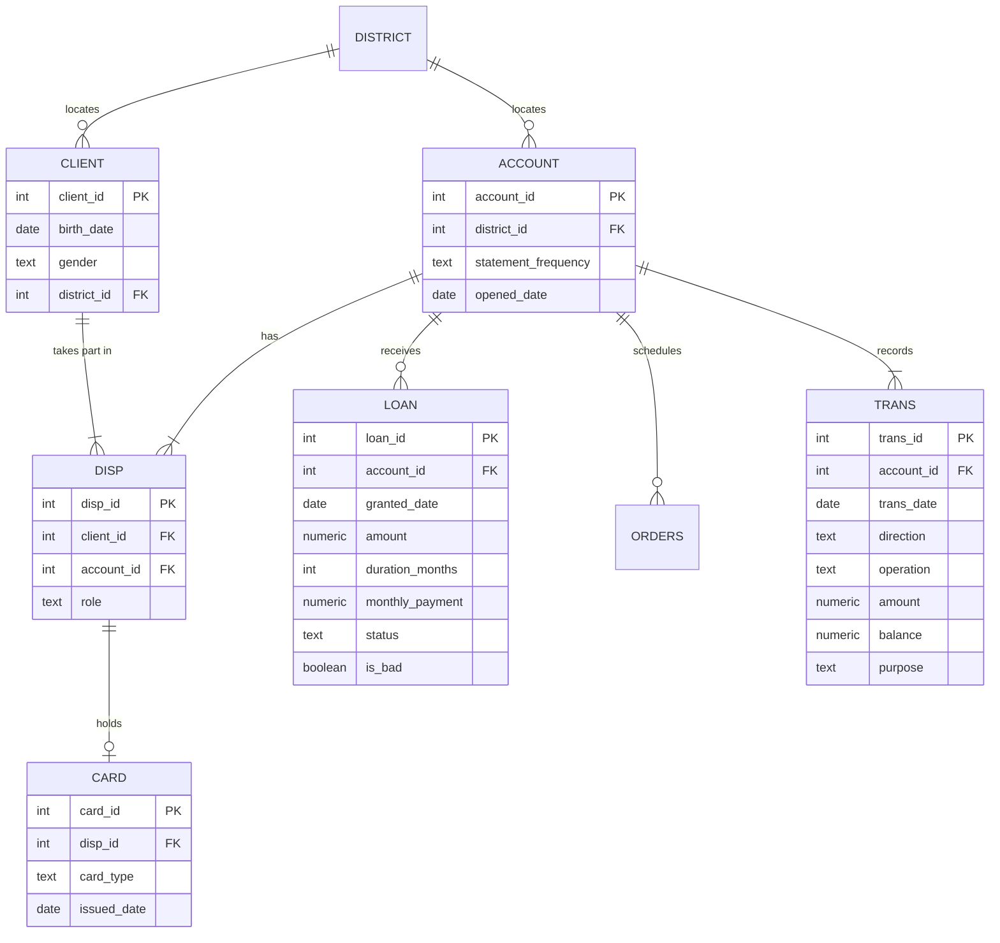

# Retail banking in SQL: credit risk, cross-sell and cohorts

An analysis of a real bank using **PostgreSQL only**: from eight raw files to three business answers, with data quality tests and a measured performance study. No Python, no BI tool: everything here is SQL and PL/pgSQL, and it starts with one Docker command.

🇪🇸 [Versión en español](README.md)

## Results in one minute

| Question | Answer |
| --- | --- |
| Does account behaviour before a loan anticipate default? | Yes. Three signals visible on the day the loan is granted sort loans into four tiers: 9.5% of loans hold 50% of defaults, and the half of the portfolio with no signal defaults only 2.3% of the time. |
| Which accounts without a card should be offered one first? | 94% of accounts without a card are active and healthy, so filtering does not help: they have to be ranked. Monthly income separates current cardholders (4.4% versus 39.6% between the lowest and highest quartile) and leaves 637 high-priority candidates. |
| Do newer accounts adopt products faster than older ones? | Yes, and the naive comparison hides it. At the end of the data every cohort has about 20% of accounts with a card, but at 12 months of age it was 1.0% of the 1993 accounts and 9.9% of the 1997 ones. |
| Does partitioning a one-million-row table make it faster? | No. A B-tree index speeds up the per-account query 90 times and a 24 kB BRIN index speeds up the monthly query 6 times. Partitioning by year did not win on any query. |

## The data

The [Berka dataset](https://www.kaggle.com/datasets/marceloventura/the-berka-dataset) (PKDD'99 Discovery Challenge, prepared by Petr Berka and Marta Sochorova) holds real, anonymized data from a Czech bank between 1993 and 1998.

| Table | Rows | Content |
| --- | --- | --- |
| `trans` | 1,056,320 | Account transactions |
| `orders` | 6,471 | Permanent payment orders |
| `client` | 5,369 | Clients |
| `disp` | 5,369 | Client-account link (owner or authorized user) |
| `account` | 4,500 | Accounts |
| `card` | 892 | Cards |
| `loan` | 682 | Loans |
| `district` | 77 | District demographics |

The data is not included in this repository; download instructions are below.



## How it is organized

Data moves through schemas, and each script builds the next one:

```
.csv files  →  raw  →  clean  →  quality    (data quality tests)
                              →  analytics  (business questions)
                              →  perf       (performance measurements)
```

| Script | What it does |
| --- | --- |
| `sql/01_raw_load.sql` | Loads the 8 files as they are, everything as text, and compares row counts with the published ones |
| `sql/02_clean.sql` | Real types, primary and foreign keys, `CHECK` constraints; converts `YYMMDD` dates, splits birth date and gender, translates the Czech codes |
| `sql/03_quality.sql` | 25 data quality tests with `error` or `warn` severity |
| `sql/04_loan_risk.sql` | Question 1: credit risk |
| `sql/05_card_crosssell.sql` | Question 2: card cross-sell |
| `sql/06_cohort_adoption.sql` | Question 3: product adoption by cohort |
| `sql/07_performance.sql` | Performance study in four scenarios |

Every script can be run again: each one drops and recreates what it builds.

## How to reproduce it

Requirements: Docker Desktop.

1. Clone the repository and create a `.env` file at the root:

   ```
   POSTGRES_USER=berka
   POSTGRES_PASSWORD=choose_a_password
   ```

2. Download the Berka dataset (it is on Kaggle as "Berka dataset") and copy the 8 files into the `data/` folder: `account.csv`, `card.csv`, `client.csv`, `disp.csv`, `district.csv`, `loan.csv`, `order.csv` and `trans.csv`. If your download uses another extension, adjust the paths at the end of `01_raw_load.sql`.

3. Start the database and open the console:

   ```
   docker compose up -d
   docker compose exec db psql -U berka -d berka
   ```

4. Run the scripts in order:

   ```
   \i /docker-entrypoint-initdb.d/01_raw_load.sql
   \i /docker-entrypoint-initdb.d/02_clean.sql
   \i /docker-entrypoint-initdb.d/03_quality.sql
   \i /docker-entrypoint-initdb.d/04_loan_risk.sql
   \i /docker-entrypoint-initdb.d/05_card_crosssell.sql
   \i /docker-entrypoint-initdb.d/06_cohort_adoption.sql
   \i /docker-entrypoint-initdb.d/07_performance.sql
   ```

It uses PostgreSQL 18. Everything runs in a few minutes.

## Data quality

Each test is a query that returns the rows that **violate** a rule; zero rows means it passes (the same convention dbt uses). Keys and `CHECK` constraints already guarantee uniqueness and referential integrity, so the tests cover what a constraint cannot express: rules across tables, temporal consistency, and balances that reconcile.

**Result: 25 tests, 18 pass, 7 documented warnings, 0 failures.**

| Finding | Size | Decision |
| --- | --- | --- |
| Rounding differences in balances | 5,296 of 406,941 transactions checked (1.3%), all exactly 0.10 | Accepted |
| Accounts with a negative balance at some point | 288 (6.4%) | Overdraft signal for the risk analysis |
| Owners under 18 when the account was opened | 371 (8.2%), aged 10 to 17 | Youth accounts; treated as a separate segment |
| Zero-amount transactions | 14 | Automatic month-end postings; excluded from penalty counts |
| Loan payment different from the instalment | 1 | Not reviewed |
| Transfer without a counterparty | 1 | Not reviewed |
| District with missing 1995 indicators | 1 | Kept as `NULL` |

### The test that failed

The balance test (each balance must equal the previous one plus or minus the amount) failed on 5,296 transactions. Instead of raising the tolerance until it passed, the failure was investigated:

1. **A sign error in the cleaning step?** Failures were grouped by transaction type. None was explained by an inverted sign, and the `VYBER` transactions, which were the suspects, did not fail once in 9,597.
2. **Where do they concentrate?** Almost only in transactions with fractional amounts (interest and instalments), and never in round-amount ones: 0 failures in 261,075 withdrawals, standing orders and insurance payments.
3. **How large are they?** All 5,296 differences are exactly 0.10, the smallest unit in which the dataset publishes amounts and balances.

Conclusion: it is rounding in the source, not missing transactions. The test was split in two: `running_balance_mismatch` (error, difference above 0.1) and `running_balance_rounding` (warning, up to 0.1).

A design detail: the dataset has no time of day and the IDs do not follow chronological order, so the order of two transactions on the same day is unknown. The balance tests only check days with a single transaction, to avoid reporting false errors.

## Question 1: does prior behaviour anticipate default?

A loan counts as bad if its status is B (finished, unpaid) or D (running, in debt): 76 of 682, or 11.1%.

**Core rule:** the features use only transactions dated before the loan. What happens afterwards describes the default; it does not anticipate it.

### Leakage, measured

| Signal | Without the signal | With the signal |
| --- | --- | --- |
| Negative balance over the whole history | 0 of 606 bad (0%) | 76 of 76 bad (100%) |
| Negative balance before the loan | 49 of 655 bad (7.5%) | 27 of 27 bad (100%) |

In this dataset, "bad loan" and "the account was overdrawn at some point" are exactly the same set. A model using that variable would be right 100% of the time and useless.

### Early-warning rule

| Tier | Signal when the loan is granted | Loans | Default rate | Cumulative defaults |
| --- | --- | --- | --- | --- |
| 1 | Overdraft or penalty interest before the loan | 31 | 90.3% | 37% |
| 2 | New account **and** large loan | 34 | 29.4% | 50% |
| 3 | One of the two | 273 | 11.0% | 89% |
| 4 | No signal | 344 | 2.3% | 100% |

- **New account:** 8 months old or less.
- **Large loan:** top quartile of loan amount over prior average balance (about 5 times the balance or more).

The two signals are distinct and they add up: each one alone takes default to about 11%, and together to 29.4%.

### What does not predict

The owner's age (11.1% versus 10.6% between extreme quartiles) and monthly inflow add nothing. The balance trend looked predictive (18.8% in the worst quartile), but once the already-overdrawn accounts were removed the signal vanished: it was all theirs.

### Limits

- The rule was defined and measured on the same 682 loans, with no validation data. It describes this portfolio; it is not a tested model.
- The 90% in the first tier is partly by construction, because default and overdraft coincide.
- Only granted loans are present; nothing is known about rejected applications.
- Tier 2 has 34 loans: the order of the tiers is solid, the exact percentage is not.

## Question 2: who should be offered a card first?

892 of 4,500 accounts have a card (19.8%): 659 `classic`, 145 `junior` and 88 `gold`.

### The filter does not filter

| Step | Accounts |
| --- | --- |
| All | 4,500 |
| Without a card | 3,608 |
| And active (transactions in 10 of the last 12 months) | 3,562 |
| And healthy (no overdraft, penalties or bad loan) | 3,381 |

"Active and healthy" describes almost the whole bank. The value is in ranking the candidates, not in filtering them.

### Who has a card today

| Quartile of monthly inflow to the account | Penetration |
| --- | --- |
| 1 (lowest) | 4.4% |
| 2 | 10.0% |
| 3 | 25.2% |
| 4 (highest) | 39.6% |

Age only matters at the extremes: between 18 and 59 penetration ranges from 20% to 25%; it drops to 6.1% above 60.

Inflow is used because having a card does not change it. Balance and withdrawals do change after getting one, and using them would be the same leakage as in question 1.

### Prioritization

Each candidate gets the penetration of its income and age segment: the share of similar accounts that already have a card.

| Priority | Candidates | Segment penetration |
| --- | --- | --- |
| High (1.5 times the overall rate or more) | 637 | 39.2% |
| Medium | 787 | 25.1% |
| Low | 1,957 | 6.3% |

### Negative result: gold card

It was not possible to identify candidates for `gold`. 77% of `gold` cards are in the top three income deciles, but even there they are only 13% of cards. Income tells where `gold` exists, not who would take it. The threshold was set before seeing the result and was not moved to force a recommendation.

### Limits

- Penetration reflects whom the bank offered a card to, not only who wants one.
- The profile is measured at the end of the data, not before each client got their card.
- The thresholds for "active" and "healthy" are my own choices, written at the top of the script.

## Question 3: do newer accounts adopt products faster?

Comparing "how many accounts have a card" by opening year is misleading: the 1993 accounts have six years of life and the 1997 ones have one or two. The fair comparison is at the same account age.

### Cards

| Cohort | Accounts | With a card at the end | At 12 months | At 24 months | At 36 months |
| --- | --- | --- | --- | --- | --- |
| 1993 | 1,139 | 19.0% | 1.0% | 3.5% | 7.4% |
| 1994 | 439 | 21.4% | 1.8% | 6.4% | 12.5% |
| 1995 | 661 | 21.8% | 3.0% | 10.0% | 17.9% |
| 1996 | 1,363 | 19.4% | 4.3% | 13.5% | · |
| 1997 | 898 | 19.4% | 9.9% | · | · |

The "at the end" column says all cohorts are alike. At the same age, each cohort adopts faster than the one before. The calendar matters too: 1998 was the year with the most cards issued for every cohort.

**Censored data:** a cohort is only reported at an age once all of its accounts have reached it. The other cells are left empty (·), not zero, because it cannot be known yet.

### Loans

Every loan is granted between 3 and 22 months into the account's life. Adoption at 24 months rises from 13.2% in the 1993 cohort to 17.2% in the 1996 one.

### Limits

- Age, year and cohort are tied together (age = year − cohort), so they cannot be fully separated.
- Not a single loan after 22 months is too clean to be real behaviour; it probably reflects how the dataset was built.

## Performance

Four queries in four scenarios, median of 5 runs after one warm-up run. The two clear improvements are in bold. Measurements are taken by a PL/pgSQL procedure that runs `EXPLAIN (ANALYZE, BUFFERS, FORMAT JSON)` and extracts the metrics from the JSON.

| Query | Baseline | B-tree | BRIN | Partitioned by year |
| --- | --- | --- | --- | --- |
| Transactions of one account | 28.06 ms | **0.31 ms** | 0.36 ms | 0.33 ms |
| Totals for one month | 29.76 ms | 31.04 ms | **4.95 ms** | 18.61 ms |
| Monthly balance per account, one year | 174.35 ms | 172.44 ms | 154.11 ms | 151.24 ms |
| Loans with their prior history | 54.06 ms | 54.83 ms | 53.56 ms | 77.08 ms |

8 kB pages read, which do not depend on how busy the machine is:

| Query | Baseline | B-tree | BRIN | Partitioned by year |
| --- | --- | --- | --- | --- |
| Transactions of one account | 12,079 | 632 | 632 | 647 |
| Totals for one month | 12,019 | 12,019 | 386 | 3,250 |
| Monthly balance per account, one year | 12,003 | 12,003 | 3,685 | 3,670 |
| Loans with their prior history | 12,035 | 12,035 | 12,035 | 12,037 |

| Object | Size |
| --- | --- |
| Table `clean.trans` | 94 MB |
| B-tree index `(account_id, trans_date)` | 21 MB |
| BRIN index `(trans_date)` | 24 kB |
| Partitioned copy with its indexes | 138 MB |

### What it shows

- **The B-tree is the big win:** 90 times faster to fetch one account.
- **The BRIN is the best value:** 24 kB to speed up the monthly query 6 times. It works because rows are stored in date order on disk (physical correlation of 1.000).
- **An index has to match the filter:** the B-tree starts with `account_id`, so it does not help date queries.
- **Reading less is not always taking less time:** the yearly query reads three times fewer pages and improves only 13%, because the time goes into grouping.
- **Some queries are not fixed by indexes:** the loan join needs almost the whole table. The fix is to store the result in a materialized view (`analytics.loan_features`).

### Decision: do not partition

Partitioning by year was almost four times slower than the BRIN on the monthly query, tied on the yearly one, and was 43% slower on the join, because it scans six tables instead of one. It also forces the date into the primary key. With one million rows it is not worth it; it would be with tens of millions, or if whole years had to be archived.

Timings come from a single machine and vary between runs.

## SQL techniques used

- **Modelling:** one schema per layer, primary and foreign keys, `CHECK` constraints, generated columns.
- **Window functions:** `lag`, `ntile`, `row_number`, running totals, aggregates over partitions.
- **Aggregation:** `FILTER`, `percentile_cont`, `bool_or`, pivots with `FILTER`.
- **Reshaping:** `CROSS JOIN LATERAL (VALUES …)` to turn columns into rows, `generate_series` to build grids.
- **Persistence:** views and materialized views with a unique index.
- **PL/pgSQL:** procedures with dynamic SQL, a data quality test runner, and a performance benchmark that reads JSON plans with `jsonb_path_query`.
- **Performance:** B-tree and BRIN indexes, declarative partitioning, reading execution plans.

## What I would do next

- Validate the risk rule on data that was not used to define it.
- Measure cardholders' profile before they got the card, not at the end of the data.
- Run the quality tests in continuous integration and fail the build if any `error` test does not pass.

## Source and credits

Data: PKDD'99 Discovery Challenge, prepared by Petr Berka and Marta Sochorova. The data belongs to its owners and is not redistributed here.

Author: Isaac Martínez · [github.com/isaacmartinez23](https://github.com/isaacmartinez23)
