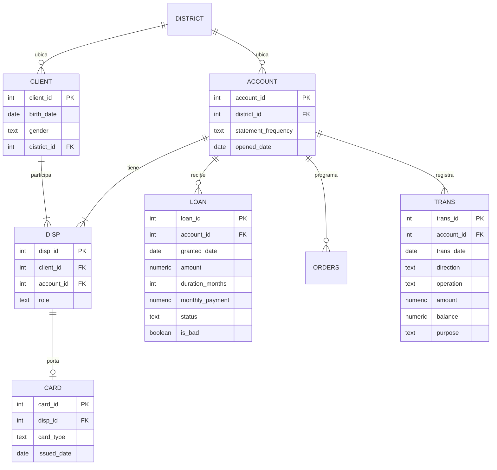

# Banca minorista en SQL: riesgo de crédito, venta cruzada y cohortes

Análisis de un banco real con **solo PostgreSQL**: de ocho archivos crudos a tres respuestas de negocio, con pruebas de calidad de datos y un estudio de rendimiento medido. Sin Python, sin herramienta de BI: todo lo que hay aquí es SQL y PL/pgSQL, y se levanta con un comando de Docker.

🇬🇧 [English version](README.en.md)

## Resultados en un minuto

| Pregunta | Respuesta |
| --- | --- |
| ¿El comportamiento previo de la cuenta anticipa el impago de un préstamo? | Sí. Tres señales visibles el día del otorgamiento ordenan los préstamos en cuatro niveles: el 9.5% de los préstamos concentra el 50% de los impagos, y la mitad de la cartera sin ninguna señal falla solo el 2.3% de las veces. |
| ¿A qué cuentas sin tarjeta conviene ofrecérsela primero? | El 94% de las cuentas sin tarjeta es activa y sana, así que filtrar no sirve: hay que ordenar. El ingreso mensual separa a quienes ya tienen tarjeta (4.4% contra 39.6% entre el cuartil más bajo y el más alto) y deja 637 candidatas de prioridad alta. |
| ¿Las cuentas nuevas adoptan productos más rápido que las viejas? | Sí, y la comparación ingenua lo esconde. Al cierre todas las cohortes tienen cerca de 20% de cuentas con tarjeta, pero a los 12 meses de vida la tenía el 1.0% de las de 1993 y el 9.9% de las de 1997. |
| ¿Particionar la tabla de un millón de filas la hace más rápida? | No. Un índice B-tree acelera 90 veces la consulta por cuenta y un BRIN de 24 kB acelera 6 veces la consulta mensual. Particionar por año no ganó en ninguna consulta. |

## Los datos

El [dataset Berka](https://sorry.vse.cz/~berka/challenge/pkdd1999/berka.htm) (PKDD'99 Discovery Challenge, preparado por Petr Berka y Marta Sochorova) contiene datos reales y anonimizados de un banco checo entre 1993 y 1998.

| Tabla | Filas | Contenido |
| --- | --- | --- |
| `trans` | 1,056,320 | Movimientos de las cuentas |
| `orders` | 6,471 | Órdenes de pago permanentes |
| `client` | 5,369 | Clientes |
| `disp` | 5,369 | Relación cliente-cuenta (titular o autorizado) |
| `account` | 4,500 | Cuentas |
| `card` | 892 | Tarjetas |
| `loan` | 682 | Préstamos |
| `district` | 77 | Demografía por distrito |

Los datos no se incluyen en el repositorio; abajo se explica cómo descargarlos.



## Cómo está organizado

Los datos avanzan por esquemas, y cada script construye el siguiente:

```
archivos .csv  →  raw  →  clean  →  quality    (pruebas de calidad)
                                 →  analytics  (preguntas de negocio)
                                 →  perf       (mediciones de rendimiento)
```

| Script | Qué hace |
| --- | --- |
| `sql/01_raw_load.sql` | Carga los 8 archivos tal cual, todo como texto, y compara los conteos con los publicados |
| `sql/02_clean.sql` | Tipos reales, llaves primarias y foráneas, restricciones `CHECK`; convierte fechas `YYMMDD`, separa fecha de nacimiento y género, traduce los códigos en checo |
| `sql/03_quality.sql` | 25 pruebas de calidad con severidad `error` o `warn` |
| `sql/04_loan_risk.sql` | Pregunta 1: riesgo de crédito |
| `sql/05_card_crosssell.sql` | Pregunta 2: venta cruzada de tarjetas |
| `sql/06_cohort_adoption.sql` | Pregunta 3: adopción de productos por cohorte |
| `sql/07_performance.sql` | Estudio de rendimiento en cuatro escenarios |

Todos los scripts se pueden volver a correr: borran y recrean lo que construyen.

## Cómo reproducirlo

Requisitos: Docker Desktop.

1. Clona el repositorio y crea un archivo `.env` en la raíz:

   ```
   POSTGRES_USER=berka
   POSTGRES_PASSWORD=elige_una_contraseña
   ```

2. Descarga el dataset Berka desde [Kaggle](https://www.kaggle.com/datasets/marceloventura/the-berka-dataset) y copia los 8 archivos a la carpeta `data/`: `account.csv`, `card.csv`, `client.csv`, `disp.csv`, `district.csv`, `loan.csv`, `order.csv` y `trans.csv`. Si tu descarga trae otra extensión, ajusta las rutas al final de `01_raw_load.sql`.

3. Levanta la base. La primera vez carga los datos y corre los siete scripts sola, en orden:

   ```
   docker compose up -d
   docker compose logs -f db
   ```

   Espera el mensaje `PostgreSQL init process complete; ready for start up` y sal con Ctrl+C. Si los archivos no están en `data/`, la carga falla y el contenedor se detiene: cópialos y vuelve a empezar con `docker compose down -v`.

4. Entra a la consola para explorar los resultados, con el usuario de tu `.env`:

   ```
   docker compose exec db psql -U berka -d berka
   ```

   Las tablas de resultados de cada script quedan en el registro del paso 3. Para volver a imprimirlas, corre de nuevo el script que te interese desde dentro de la consola, donde el indicador dice `berka=#`:

   ```
   \i /docker-entrypoint-initdb.d/04_loan_risk.sql
   ```

Usa PostgreSQL 18. Todo corre en unos minutos.

## Calidad de datos

Cada prueba es una consulta que devuelve las filas que **violan** una regla; cero filas significa que pasa (la misma convención que usa dbt). Las llaves y los `CHECK` ya garantizan unicidad e integridad referencial, así que las pruebas cubren lo que una restricción no puede expresar: reglas entre tablas, coherencia temporal y que los saldos cuadren.

**Resultado: 25 pruebas, 18 pasan, 7 avisos documentados, 0 fallas.**

| Hallazgo | Magnitud | Decisión |
| --- | --- | --- |
| Diferencias de redondeo en saldos | 5,296 de 406,941 movimientos evaluados (1.3%), todas de exactamente 0.10 | Se aceptan |
| Cuentas con saldo negativo en algún momento | 288 (6.4%) | Señal de sobregiro para el análisis de riesgo |
| Titulares menores de edad al abrir la cuenta | 371 (8.2%), de 10 a 17 años | Cuentas juveniles; segmento aparte |
| Transacciones con monto cero | 14 | Asientos automáticos de fin de mes; se excluyen de los conteos de penalización |
| Pago de préstamo distinto a la mensualidad | 1 | Sin revisar |
| Transferencia sin contraparte | 1 | Sin revisar |
| Distrito con indicadores de 1995 faltantes | 1 | Se conserva como `NULL` |

### La prueba que falló

La prueba de saldos (cada saldo debe ser el anterior más o menos el monto) falló en 5,296 movimientos. En lugar de subir la tolerancia hasta que pasara, se investigó:

1. **¿Error de signo en la limpieza?** Se agruparon las fallas por tipo de movimiento. Ninguna se explicaba por un signo invertido, y los movimientos de tipo `VYBER`, que eran los sospechosos, no fallaron ni una vez en 9,597.
2. **¿Dónde se concentran?** Casi solo en movimientos con monto fraccionario (intereses y mensualidades), y nunca en los de monto cerrado: 0 fallas en 261,075 retiros, domiciliaciones y seguros.
3. **¿De qué tamaño son?** Las 5,296 diferencias miden exactamente 0.10, la unidad mínima con que el dataset publica montos y saldos.

Conclusión: es redondeo del origen, no movimientos faltantes. La prueba se dividió en dos: `running_balance_mismatch` (error, diferencia mayor a 0.1) y `running_balance_rounding` (aviso, hasta 0.1).

Un detalle de diseño: el dataset no trae hora y los IDs no siguen el orden cronológico, así que el orden de dos movimientos del mismo día es desconocido. Las pruebas de saldo solo evalúan días con un único movimiento, para no reportar errores falsos.

## Pregunta 1: ¿el comportamiento previo anticipa el impago?

Un préstamo cuenta como malo si su estatus es B (terminado sin pagar) o D (vigente con adeudo): 76 de 682, el 11.1%.

**Regla central:** las variables usan solo movimientos anteriores a la fecha del préstamo. Lo que pasa después describe el impago, no lo anticipa.

### La fuga de información, medida

| Señal | Sin la señal | Con la señal |
| --- | --- | --- |
| Saldo negativo en todo el historial | 0 de 606 malos (0%) | 76 de 76 malos (100%) |
| Saldo negativo antes del préstamo | 49 de 655 malos (7.5%) | 27 de 27 malos (100%) |

En este dataset, "préstamo malo" y "la cuenta estuvo sobregirada alguna vez" son exactamente el mismo conjunto. Un modelo con esa variable acertaría el 100% y no serviría para nada.

### Regla de alerta temprana

| Nivel | Señal al momento de otorgar | Préstamos | Tasa de impago | Impagos acumulados |
| --- | --- | --- | --- | --- |
| 1 | Sobregiro o penalización antes del préstamo | 31 | 90.3% | 37% |
| 2 | Cuenta nueva **y** préstamo grande | 34 | 29.4% | 50% |
| 3 | Una de las dos | 273 | 11.0% | 89% |
| 4 | Ninguna señal | 344 | 2.3% | 100% |

- **Cuenta nueva:** 8 meses o menos de antigüedad.
- **Préstamo grande:** cuartil más alto de monto sobre saldo promedio previo (cerca de 5 veces el saldo o más).

Las dos señales son distintas y se suman: cada una por separado lleva el impago a cerca de 11%, y juntas a 29.4%.

### Lo que no predice

La edad del titular (11.1% contra 10.6% entre cuartiles extremos) y las entradas mensuales no aportan. La tendencia del saldo parecía predecir (18.8% en el peor cuartil), pero al quitar las cuentas ya sobregiradas la señal desapareció: era toda de ellas.

### Límites

- La regla se definió y se midió con los mismos 682 préstamos, sin datos de validación. Describe esta cartera; no es un modelo probado.
- El 90% del primer nivel es en parte por construcción, por la equivalencia entre impago y sobregiro.
- Solo hay préstamos otorgados; no se sabe nada de las solicitudes rechazadas.
- El nivel 2 tiene 34 préstamos: el orden de los niveles es sólido, el porcentaje exacto no.

## Pregunta 2: ¿a quién ofrecerle tarjeta primero?

892 de 4,500 cuentas tienen tarjeta (19.8%): 659 `classic`, 145 `junior` y 88 `gold`.

### El filtro no filtra

| Paso | Cuentas |
| --- | --- |
| Todas | 4,500 |
| Sin tarjeta | 3,608 |
| Y además activas (movimientos en 10 de los últimos 12 meses) | 3,562 |
| Y además sanas (sin sobregiro, penalizaciones ni préstamo malo) | 3,381 |

"Activa y sana" describe a casi todo el banco. El valor está en ordenar a las candidatas, no en filtrarlas.

### Quién tiene tarjeta hoy

| Cuartil de ingreso mensual a la cuenta | Penetración |
| --- | --- |
| 1 (más bajo) | 4.4% |
| 2 | 10.0% |
| 3 | 25.2% |
| 4 (más alto) | 39.6% |

La edad solo pesa en los extremos: entre 18 y 59 años la penetración va de 20% a 25%; cae a 6.1% en mayores de 60.

Se usa el ingreso porque tener tarjeta no lo cambia. El saldo y los retiros sí cambian después de recibirla, y usarlos sería la misma fuga de información de la pregunta 1.

### Priorización

Cada candidata recibe la penetración de su segmento de ingresos y edad: qué porcentaje de las cuentas parecidas ya tiene tarjeta.

| Prioridad | Candidatas | Penetración de su segmento |
| --- | --- | --- |
| Alta (1.5 veces la general o más) | 637 | 39.2% |
| Media | 787 | 25.1% |
| Baja | 1,957 | 6.3% |

### Resultado negativo: tarjeta gold

No fue posible identificar candidatas para `gold`. El 77% de las `gold` está en los tres deciles de ingreso más altos, pero ahí son solo el 13% de las tarjetas. El ingreso dice dónde existe la `gold`, no quién la tomaría. El umbral se fijó antes de ver el resultado y no se movió para forzar una recomendación.

### Límites

- La penetración refleja a quién le ofreció tarjeta el banco, no solo quién la quiere.
- El perfil se mide al cierre de los datos, no antes de que cada cliente recibiera su tarjeta.
- Los umbrales de "activa" y "sana" son decisiones propias, escritas al inicio del script.

## Pregunta 3: ¿las cuentas nuevas adoptan productos más rápido?

Comparar "cuántas cuentas tienen tarjeta" por año de apertura es engañoso: las de 1993 llevan seis años de vida y las de 1997 uno o dos. La comparación justa es a la misma edad de la cuenta.

### Tarjetas

| Cohorte | Cuentas | Con tarjeta al cierre | A los 12 meses | A los 24 meses | A los 36 meses |
| --- | --- | --- | --- | --- | --- |
| 1993 | 1,139 | 19.0% | 1.0% | 3.5% | 7.4% |
| 1994 | 439 | 21.4% | 1.8% | 6.4% | 12.5% |
| 1995 | 661 | 21.8% | 3.0% | 10.0% | 17.9% |
| 1996 | 1,363 | 19.4% | 4.3% | 13.5% | · |
| 1997 | 898 | 19.4% | 9.9% | · | · |

La columna "al cierre" dice que todas las cohortes son iguales. A la misma edad, cada cohorte adopta más rápido que la anterior. También pesa el calendario: 1998 fue el año con más tarjetas emitidas para todas las cohortes.

**Datos censurados:** una cohorte solo se reporta a una edad cuando todas sus cuentas ya la cumplieron. Las demás celdas quedan vacías (·), no en cero, porque todavía no se puede saber.

### Préstamos

Todos los préstamos se otorgan entre los 3 y los 22 meses de vida de la cuenta. La adopción a 24 meses sube de 13.2% en la cohorte de 1993 a 17.2% en la de 1996.

### Límites

- La edad, el año y la cohorte están atados entre sí (edad = año − cohorte), así que no se pueden separar del todo.
- Que no haya ni un préstamo después de los 22 meses es demasiado limpio para ser comportamiento real; probablemente refleja cómo se construyó el dataset.

## Rendimiento

Cuatro consultas en cuatro escenarios, mediana de 5 ejecuciones tras una de calentamiento. En negritas, las dos mejoras claras. Las mediciones las hace un procedimiento en PL/pgSQL que ejecuta `EXPLAIN (ANALYZE, BUFFERS, FORMAT JSON)` y extrae las métricas del JSON.

| Consulta | Base | B-tree | BRIN | Partición por año |
| --- | --- | --- | --- | --- |
| Movimientos de una cuenta | 28.06 ms | **0.31 ms** | 0.36 ms | 0.33 ms |
| Totales de un mes | 29.76 ms | 31.04 ms | **4.95 ms** | 18.61 ms |
| Saldo mensual por cuenta, un año | 174.35 ms | 172.44 ms | 154.11 ms | 151.24 ms |
| Préstamos con su historial previo | 54.06 ms | 54.83 ms | 53.56 ms | 77.08 ms |

Páginas de 8 kB leídas, que no dependen de la carga de la máquina:

| Consulta | Base | B-tree | BRIN | Partición por año |
| --- | --- | --- | --- | --- |
| Movimientos de una cuenta | 12,079 | 632 | 632 | 647 |
| Totales de un mes | 12,019 | 12,019 | 386 | 3,250 |
| Saldo mensual por cuenta, un año | 12,003 | 12,003 | 3,685 | 3,670 |
| Préstamos con su historial previo | 12,035 | 12,035 | 12,035 | 12,037 |

| Objeto | Tamaño |
| --- | --- |
| Tabla `clean.trans` | 94 MB |
| Índice B-tree `(account_id, trans_date)` | 21 MB |
| Índice BRIN `(trans_date)` | 24 kB |
| Copia particionada con sus índices | 138 MB |

### Qué se aprende

- **El B-tree es la mejora grande:** 90 veces más rápido para buscar una cuenta.
- **El BRIN es la mejor relación costo-beneficio:** 24 kB para acelerar 6 veces la consulta mensual. Funciona porque las filas están ordenadas por fecha en el disco (correlación física de 1.000).
- **Un índice tiene que coincidir con el filtro:** el B-tree empieza por `account_id`, así que no ayuda a las consultas por fecha.
- **Leer menos no siempre es tardar menos:** la consulta anual lee tres veces menos páginas y solo mejora 13%, porque el tiempo se va en agrupar.
- **Algunas consultas no se arreglan con índices:** la unión de préstamos necesita casi toda la tabla. La solución es guardar el resultado en una vista materializada (`analytics.loan_features`).

### Decisión: no particionar

Particionar por año quedó casi cuatro veces más lento que el BRIN en la consulta mensual, empató en la anual y fue 43% más lento en la unión, porque recorre seis tablas en lugar de una. Además obliga a incluir la fecha en la llave primaria. Con un millón de filas no se justifica; se justificaría con decenas de millones o si hubiera que archivar años completos.

Los tiempos son de una sola máquina y varían entre corridas.

## Técnicas de SQL utilizadas

- **Modelado:** esquemas por capa, llaves primarias y foráneas, restricciones `CHECK`, columnas generadas.
- **Funciones de ventana:** `lag`, `ntile`, `row_number`, sumas acumuladas, agregados sobre particiones.
- **Agregación:** `FILTER`, `percentile_cont`, `bool_or`, pivotes con `FILTER`.
- **Remodelado:** `CROSS JOIN LATERAL (VALUES …)` para pasar columnas a filas, `generate_series` para construir rejillas.
- **Persistencia:** vistas y vistas materializadas con índice único.
- **PL/pgSQL:** procedimientos con SQL dinámico, un corredor de pruebas de calidad y un banco de pruebas de rendimiento que lee planes en JSON con `jsonb_path_query`.
- **Rendimiento:** índices B-tree y BRIN, particionamiento declarativo, lectura de planes de ejecución.

## Qué haría después

- Validar la regla de riesgo con datos que no se usaron para definirla.
- Medir el perfil de quienes tienen tarjeta antes de recibirla, no al cierre.
- Correr las pruebas de calidad en integración continua y hacer fallar el proceso si alguna de severidad `error` no pasa.

## Fuente y créditos

Datos: PKDD'99 Discovery Challenge, preparados por Petr Berka y Marta Sochorova. Los datos pertenecen a sus responsables y no se redistribuyen aquí.

Autor: Isaac Martínez · [isaacmartinez.space](https://isaacmartinez.space) · [github.com/isaacmartinez23](https://github.com/isaacmartinez23)